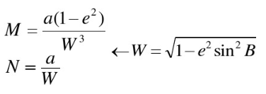
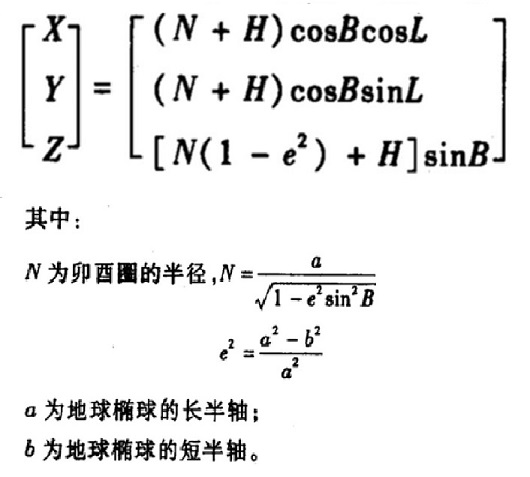
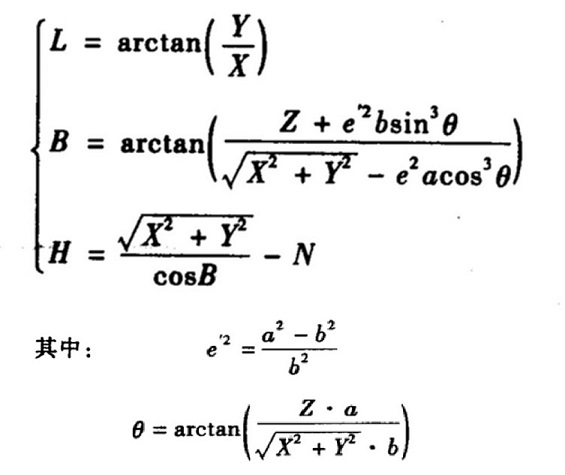
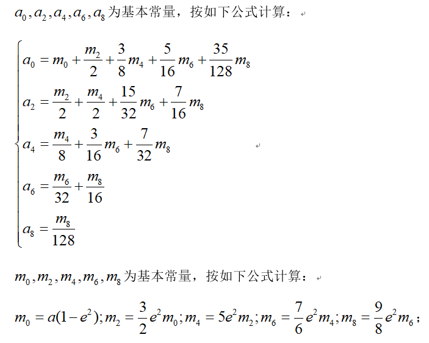

## WGSToSZ独立坐标变换方法

### 一、相关概念

大地坐标系（B, L, H) (纬度、经度、高度):B为过坐标点椭球面的法线与赤道面交角，L为过坐标点的子午线与起始子午线的夹角，H为坐标点沿法线到椭球面的距离。

空间直角坐标(X, Y, Z):Z轴与旋转椭球的短轴重合，向北为正，X轴与赤道面和首子午面的交线重合，向东为正。Y轴与XZ平面垂直构成右手系。

参心坐标系：

参考椭球的几何中心为原点的大地坐标系。通常分为：参心空间直角坐标系（以x，y，z为其坐标元素）和参心大地坐标系（以B，L，H为其坐标元素）。

地心坐标系：

以地球质心(总椭球的几何中心)为原点的大地坐标系。通常分为地心空间直角坐标系(以x，y，z为其坐标元素)和地心大地坐标系(以B，L，H为其坐标元素)。

椭球长半轴:

椭球扁率:

椭球短半轴：

椭球第一偏心率 ：

椭球第二偏心率 ：

卯酉圈曲率半径N：子午圈曲率半径M：



补充：

### 二、转换方法

##### 1.已知WGS--84大地坐标（BLH）(单位：度.分秒)

1）BLH》》十进制度》》弧度制

​	可参考EXCEL中方法：

​	RADIANS(25\*B/9-2\*INT(B)/3-INT(100\*B)/90)

2）转为北京54空间直角坐标系(克拉索夫斯基椭球)(BLH->XYZ)

​	参考公式：

​	

​	PS:这里WGS84为地心坐标系而北京54为参心坐标系，（**个人认为因为他们空间直角坐标系的轴方向一致，所以此处只需要添加XYZ的坐标偏移参数无需其他是三个旋转参数以及一个尺度参数**），计算完后需要给XYZ加上常量，具体数值如下:

​	X:-22,Y:+188,Z+30.5

3)北京54的空间直角坐标系转换为其大地坐标系（ XYZ → BLH ）

​	参考方法:

​	

​	求解方法：

​	1.迭代法：

​	取B初值为:

​	C#代码实现：

```c#
//输入XYZ
double X = -2368953, Y = 5382025, Z = 2462584;
//相关参数
double a, N, W, e1, r, sinB;
double B1, B0, H1, H0, B, L, H;
a = 6378245;
e1 = 0.006693421622966;
r = X * X + Y * Y;
L = Math.Atan(Y / X) + Math.PI;
B0 = Math.Atan(Z / Math.Sqrt(r));
sinB = Math.Sin(B0);
W = Math.Sqrt(1 - e1 * sinB * sinB);
N = a / W;
H0 = Z / sinB - N * (1 - e1);
int maxIter = 100;
int iter = 0;
while (true)
{
    iter++;
    B1 = Math.Atan2(Z * (N + H0), Math.Sqrt(r) * (N * (1 - e1) + H0));
    sinB = Math.Sin(B1);
    W = Math.Sqrt(1 - e1 * sinB * sinB);
    N = a / W;
    H1 = Z / sinB - N * (1 - e1);
    if ((Math.Abs(B1 - B0) < Math.Pow(10, -15) && Math.Abs(H1 - H0) < Math.Pow(10, -15)) || iter > maxIter)
    {
        break;
    }
    B0 = B1;
    H0 = H1;
}
B = B1;
H = H1;
```

​	2.直接求解

​	参考公式：

​	

```c#
//输入XYZ
double X = -2368953, Y = 5382025, Z = 2462584;
double a = 6378245, b = 6356863.0188;
double N, W, sb;
double e2 = 0.00673852540614652;
double e1 = 0.00669342161454287;
double r = Math.Sqrt(X * X + Y * Y);
double alpha = Math.Atan(Z * a / (r * b));
double cosal = Math.Cos(alpha);
double sinal = Math.Sin(alpha);
double L = Math.Atan(Y / X) + Math.PI;
double B = Math.Atan((Z + e2 * b * sinal * sinal * sinal) / (r - e1 * a * cosal * cosal * cosal));
sb = Math.Sin(B);
W = Math.Sqrt(1 - e1 * sb * sb);
N = a / W;
double H = r / Math.Cos(B) - N;
//结果为BLH
```

​	3.EXCEL中：

​	暂过~

4）结果BLH为弧度》》转为度分秒

​	参考EXCEL中公式：

​	9\*B\*180/PI()/25+2\*INT(B\*180/PI())/5+INT(60\*B\*180/PI())/250

​	PS：后面的计算，BLH依然用弧度制，这里只是提供一个方法

5)使用高斯投影中央经线为114度

​	参考公式：

​	

​	

​	



​	C#代码实现

```c#
//输入椭球参数及坐标点
double a = 6378245, f = 0.00335232986925913;
//L0为中央子午线弧度制 这里为114度
double B = 0.398992580521256, L = 1.98543736115197, L0 = 1.9896753472735356;
double x, y;

double b, c, e1, e2; //短半轴，极点处的子午线曲率半径，第一偏心率，第二偏心率
double l, W, N, M, daihao;//W为常用辅助函数，M为子午圈曲率半径，N为卯酉圈曲率半径
double X;//子午线弧长，高斯投影的坐标
double ruo, ita, sb, cb, t;
double[] m = new double[5];
double[] n = new double[5];
b = a * (1 - f);
e1 = Math.Sqrt(a * a - b * b) / a;
e2 = Math.Sqrt(a * a - b * b) / b;
c = a * a / b;
m[0] = a * (1 - e1 * e1);
m[1] = 3 * (e1 * e1 * m[0]) / 2.0;
m[2] = 5 * (e1 * e1 * m[1]) / 4.0;
m[3] = 7 * (e1 * e1 * m[2]) / 6.0;
m[4] = 9 * (e1 * e1 * m[3]) / 8.0;
n[0] = m[0] + m[1] / 2 + 3 * m[2] / 8 + 5 * m[3] / 16 + 35 * m[4] / 128;
n[1] = m[1] / 2 + m[2] / 2 + 15 * m[3] / 32 + 7 * m[4] / 16;
n[2] = m[2] / 8 + 3 * m[3] / 16 + 7 * m[4] / 32;
n[3] = m[3] / 32 + m[4] / 16;
n[4] = m[4] / 128;
X = n[0] * B - n[1] / 2 * Math.Sin(B * 2) + n[2] / 4 * Math.Sin(B * 4) - n[3] / 6 * Math.Sin(B * 6) + n[4] / 8 * Math.Sin(B * 8);
//X = n[0] * B - Math.Sin(B) * Math.Cos(B) * ((n[1] - n[2] + n[3]) + (2 * n[2] - (16 * n[3] / 3.0)) * Math.Sin(B) * Math.Sin(B) + 16 * n[3] * Math.Pow(Math.Sin(B), 4) / 3.0);
l = L - L0;//弧度 ruo无用
ita = e2 * Math.Cos(B);
sb = Math.Sin(B);
cb = Math.Cos(B);
W = Math.Sqrt(1 - e1 * e1 * sb * sb);
N = a / W;
t = Math.Tan(B);
ruo = (180 / Math.PI) * 3600;
x = (X + N * sb * cb * l * l / 2 + N * sb * cb * cb * cb * (5 - t * t + 9 * ita * ita + 4 * ita * ita * ita * ita) * l * l * l * l / 24 + N * sb * cb * cb * cb * cb * cb * (61 - 58 * t * t + t * t * t * t) * l * l * l * l * l * l / 720);
y = (N * cb * l + N * cb * cb * cb * (1 - t * t + ita * ita) * l * l * l / 6 + N * cb * cb * cb * cb * cb * (5 - 18 * t * t + t * t * t * t + 14 * ita * ita - 58 * ita * ita * t * t) * l * l * l * l * l / 120);
y = y + 500000;
```

​	6)转为独立坐标系（平面四参数转换模型）


​	X0与Y0为坐标平移量，cos α，sin α 为坐标旋转因子，m为缩放因子。x1、y1为上一步的到的高斯投影面下的坐标；

​	需要已有的地方坐标和高斯平面坐标采用坐标相似变换求其转换参数。

​	具体看另一个仓库中的脚本工具，已经基于arcpy脚本实现 最新的深圳独立坐标与84坐标的互转。

