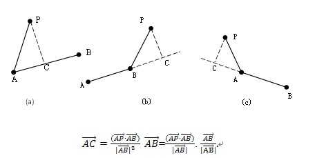

## 计算点到线段最短距离——矢量法

#### 一、思路
> 矢量算法过程清晰，如果具有一定的空间几何基础，则是解决此类问题时应优先考虑>的方法。当需要计算的数据量很大时，这种方式优势明显。

> 由于矢量具有方向性，故一些方向的判断直接根据其正负号就可以得知，使得其中的一些问题得以很简单的解决。

根据下图，可以看到，我们只需计算将其与做比较即可分出以下结果。


#### 二、步骤
·的单位向量，即可得到AC的长度值；

AC的模长与AB的单位向量相乘可以构成AC向量，所以容易得到:

最后，根据其正负以及大小可以判断出三种情况：


#### 三、代码实现
``` C#
class Segment
{
	private Point pt1;
    private Point pt2;
    private double length;
    public Segment(Point pt1, Point pt2)
    {
        this.pt1 = pt1;
        this.pt2 = pt2;
        double dx = Math.Abs(pt1.X - pt2.X);
        double dy = Math.Abs(pt1.Y - pt2.Y);
        this.length = Math.Sqrt(Math.Pow(dx, 2) + Math.Pow(dy, 2));
    }
	/// <summary>
    /// Finding the shortest distance from a point to the line segment by vector method(矢量法)
    /// </summary>
    /// <param name="p"></param>
    /// <returns></returns>
    public double Dis2Pt(Point p)
    {
        //两向量点乘 P:p  A:pt1   B:pt2  C:垂足
        //矢量法
        //不存在垂足C，求与A点距离
        double APAB = (pt2.X - pt1.X) * (p.X - pt1.X) + (pt2.Y - pt1.Y) * (p.Y - pt1.Y);
        if (APAB <= 0) { return Math.Sqrt(Math.Pow((p.X - pt1.X), 2) + Math.Pow((p.Y - pt1.Y), 2)); }
        //不存在垂足C，求与B点距离
        double AB2 = Math.Pow(length, 2);
        if (APAB >= AB2) { return Math.Sqrt(Math.Pow((p.X - pt2.X), 2) + Math.Pow((p.Y - pt2.Y), 2)); }
        //存在垂足C
        double r = APAB / AB2;
        double Cx = pt1.X + (pt2.X - pt1.X) * r;
        double Cy = pt1.Y + (pt2.Y - pt1.Y) * r;
        return Math.Sqrt(Math.Pow((p.X - Cx), 2) + Math.Pow((p.Y - Cy), 2));
    }
}
```

