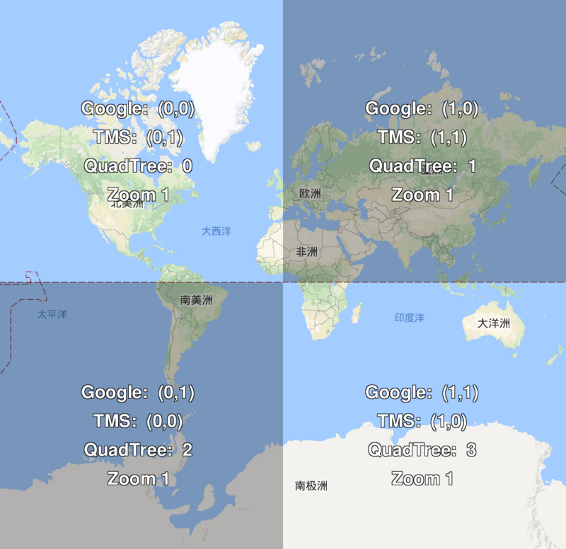

瓦片(Tile)行列号计算方法

### 1.行列号编号规则

​	在讲瓦片的时候说到过这些规则，这里重复一遍：

​	要在浏览器上把每个切片放到正确的位置，保证拼接正确，就要将每个瓦片进行**编号**，有了编号后就知道每个瓦片对应加载的位置，此处可以脑补拼图。下面先了解下编号的规则。

> **谷歌XYZ**：Z表示缩放层级，Z=zoom；XY的原点在左上角，X从左向右，Y从上向下。
>
> **TMS**：开源产品的标准，Z的定义与谷歌相同；XY的原点在左下角，X从左向右，Y从下向上。
>
> **QuadTree**：微软Bing地图使用的编码规范，Z的定义与谷歌相同，同一层级的瓦片不用XY两个维度表示，而只用一个整数表示，该整数服从四叉树编码规则
>
> **百度XYZ**：Z从1开始，在最高级就把地图分为四块瓦片；XY的原点在经度为0纬度位0的位置，X从左向右，Y从下向上。	

### 2.经纬度和行列号如何换算

​	我们知道加载瓦片需要通过相应的URL请求到对应的图片并加载至浏览器正确的位置上。通常我们使用的地图API（如ArcGIS API for JS）会帮我们把参数计算出来，我们只要拼接成正确的URL就可以加载瓦片图层了。

​	但是，如果我们想要自己爬取下载网上一些地图的瓦片，或者自己撸一个加载瓦片的方法，就要必须知道如何**经纬度**转换成瓦片的**行列号**。

​	先补一个。下列公式定义在使用墨卡托投影的地图中，从纬线φ和经线λ如何推导为坐标系中的点坐标x和y。[墨卡托投影法](https://zh.wikipedia.org/wiki/%E9%BA%A5%E5%8D%A1%E6%89%98%E6%8A%95%E5%BD%B1%E6%B3%95)

​	

​	

#### 1）OpenStreetMap

​	**特性1:**z: [0~18]    x,y: [0~(2^z-1)]

​	**特性2:**第z级别，x,y方向的瓦片个数均为：2^z

​	**特性3:**图片（z,x,y）像素（m,n）[注：像素坐标以左上角为原点，x轴向右，y轴向下]的经纬度[单位：度]分别为：

#### 2）Google Map

​	**特性1:**z: [0~18]    x,y: [0~(2^z-1)]

​	**特性2:**图片（x,y,z）像素（m,n）[注：像素坐标以左上角为原点，x轴向右，y轴向下]的经纬度[单位：度]与openmapstreet方法一致。

#### 3）Bing Map

​	