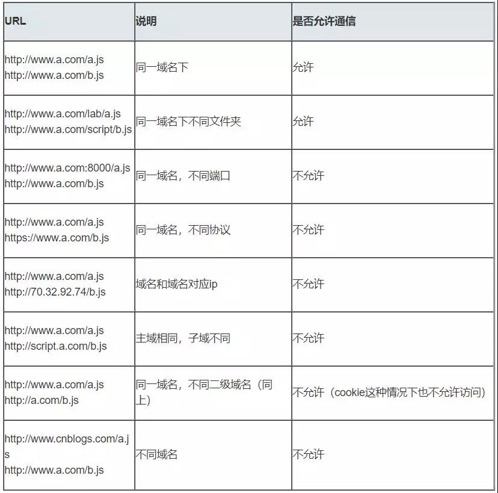

## 前言

记录一下跨域的一些学习笔记吧。
## 跨域是啥

JS处于安全方面考虑，因为同源策略限制，不允许调用不同域的对象，不同域的之间相互请求资源就叫"跨域"
### 怎么算不同域

看表看表，从其他地方扒过来的。。。。

就是看域名地址、协议、域名、端口必须一样才可以，不包括IP地址。
要是协议和端口都不一样，前端没有办法

## 同源策略及其限制是啥

>同源策略限制从一个源加载的文档或脚本如何与来自另一个源的资源进行交互。这是一个用于隔离潜在恶意文件的关键的安全机制。**它的存在可以保护用户隐私信息，防止身份伪造等(读取Cookie)。**

同源策略限制内容有：

- Cookie、LocalStorage、IndexedDB 等存储性内容
- DOM节点
- AJAX 请求不能发送

但是以下标签是允许跨域加载资源：

- ``
- `<link href="">`
- `<script src="">`
- `<iframe src="">`

## 处理跨域方法 

### 一、 JSONP（JSON with Padding）

script 标签的src属性可以跨域引用文件，jsonp是请求之后后台包装好一段json，并且把数据放在一个callback函数，返回一个js文件，动态引入这个文件，下载完成js之后，会去调用这个callback,通过这样访问数据。

在换句话说：

1.我们用ajax无法跨域访问资源

2.发现script标签的src属性没有这个限制

3.那我们现在写个url，加上需要的一些参数，比如`?callback=foo`，告诉服务器本地要用返回数据的函数叫啥。

```javascript
let foo = function(data) {
    //do something
}
```

4.服务端实现这个功能：根据这个url里带的参数，生成一个js文件，就是调用一下这个函数，生成这个函数需要的数据对象传传入，像下面这样：

```javascript
foo({
    "key1": "value1",
    "key2": "value2"
});
```

5.然后呢，客户端把这个url放到script标签的src属性里，就是相当于引入了上面调用函数的这段代码。

**无非就是函数的声明在客户端，通过script标签src属性引入外部js文件执行函数，得到结果。**这样服务器就需要动态的生成js文件。很多框架吧jsonp和ajax封装在一起方便使用，但是要知道他们本质是不同的东西。网上扒了一个图。。。应该能看出点东西吧


#### 1.JSONP和AJAX对比

AJAX属于同源策略，JSONP属于非同源策略（跨域请求）。

#### 2.JSONP优缺点

JSONP优点是兼容性好，可用于解决主流浏览器的跨域数据访问的问题。**缺点是仅支持get方法具有局限性。**

### 二、CORS

> CORS是一个W3C标准，全称是"跨域资源共享"（Cross-origin resource sharing）。它允许浏览器向跨源(协议 + 域名 + 端口)服务器，发出XMLHttpRequest请求，从而克服了AJAX只能同源使用的限制。

浏览器将CORS请求分为**简单请求（simple request）和非简单请求（not-so-simple request）**。

>  简单请求满足以下两点：
>
> 1) 请求方法是以下三种方法之一：
> HEAD
> GET
> POST
> 2）HTTP的头信息不超出以下几种字段：
> Accept
> Accept-Language
> Content-Language
> Last-Event-ID
> Content-Type：只限于三个值application/x-www-form-urlencoded、multipart/form-data、text/plain


- 对于简单请求：需要在服务器**响应头**中添加`Access-Control-Allow-Origin：*`表示允许任意域名访问某个资源，当然也可以是一个完整的域名。如果服务器没有设置返回带有特殊头部的数据，简单请求GET或者POST请求仍然会发送，服务器的数据也会返回，但是浏览器会阻止Javascript获取这次请求。

- 对于非简单请求：会在正式通信之前，增加一次HTTP查询请求，称为"预检"请求（preflight）,发送一个OPTIONS请求到服务器。如果OPTIONS的请求，服务器没有做出适当的返回，后面真实的请求将不会发送。

#### 来认识一下头信息（请求和响应）

1. Access-Control-Allow-Origin

   由服务器返回，`*`允许表示任意域名,或者一个完整的域名名字。

> 如果你需要客户端传递验证信息到头部（比如：cookies）。这个值不能为 * —— 必须为完整的域名（这点很重要）。

2. Access-Control-Allow-Credentials

   这个头部信息只会在服务器支持通过cookies传递验证信息的返回数据里。它的值只有一个就是 true。跨站点带验证信息时，服务器必须要争取设置这个值，服务器才能获取到用户的cookie。

3. Access-Control-Allow-Headers

   提供一个逗号分隔的列表表示服务器支持的请求数据类型。假如你使用自定义头部(比如：x-authentication-token 服务器需要在返回OPTIONS请求时，要把这个值放到这个头部里，否则请求会被阻止)。

4. Access-Control-Allow-Methods

   一个逗号分隔的列表，表明服务器支持的请求类型（比如：GET, POST）

5. Origin

   这个头部信息，属于请求数据的一部分。这个值表明这个请求是从浏览器打开的哪个域名下发出的。出于安全原因，浏览器不允许你修改这个值。


6. Access-Control-Max-Age

   该字段可选，用来指定本次预检请求的有效期，单位为秒。在有效期间，不用发出另一条预检请求。

#### CORS优缺点

CORS要求浏览器(>IE10)和服务器的同时支持，是跨域的根本解决方法，由浏览器自动完成。优点在于功能更加强大支持各种HTTP Method，缺点是兼容性不如JSONP。对于开发者来说，CORS通信与同源的AJAX通信没有差别，代码完全一样，只需要在服务器端加一些头信息即可

### 三、WebSocket

网上扒的、放着先后面再看。。

> Websocket是HTML5的一个持久化的协议，它实现了浏览器与服务器的全双工通信，同时也是跨域的一种解决方案。WebSocket和HTTP都是应用层协议，都基于 TCP 协议。但是 WebSocket 是一种双向通信协议，在建立连接之后，WebSocket 的 server 与 client 都能主动向对方发送或接收数据。同时，WebSocket 在建立连接时需要借助 HTTP 协议，连接建立好了之后 client 与 server 之间的双向通信就与 HTTP 无关了。

```javascript
//前端代码：
<div>user input：<input type="text"></div>
<script src="./socket.io.js"></script>
<script>
var socket = io('http://www.domain2.com:8080');
// 连接成功处理
socket.on('connect', function() {   
// 监听服务端消息
    socket.on('message', function(msg) {
        console.log('data from server: ---> ' + msg); 
    });
 // 监听服务端关闭
    socket.on('disconnect', function() { 
        console.log('Server socket has closed.'); 
    });
});
document.getElementsByTagName('input')[0].onblur = function() {
    socket.send(this.value);
};
</script>
```

```javascript
//Nodejs socket后台：
var http = require('http');
var socket = require('socket.io');
// 启http服务
var server = http.createServer(function(req, res) {
    res.writeHead(200, {
        'Content-type': 'text/html'
    });
    res.end();
});
server.listen('8080');
console.log('Server is running at port 8080...');
// 监听socket连接
socket.listen(server).on('connection', function(client) {
    // 接收信息
    client.on('message', function(msg) {
        client.send('hello：' + msg);
        console.log('data from client: ---> ' + msg);
    });
    // 断开处理
    client.on('disconnect', function() {
        console.log('Client socket has closed.'); 
    });
});
```

### 四、postMessage

>  如果两个网页不同源，就无法拿到对方的DOM。典型的例子是iframe窗口和 window.open方法打开的窗口，它们与父窗口无法通信。HTML5为了解决这个问题，引入了一个全新的API：跨文档通信 API（Cross-document messaging）。这个API为window对象新增了一个 window.postMessage 方法，允许跨窗口通信，不论这两个窗口是否同源。

**postMessage方法的第一个参数是具体的信息内容，第二个参数是接收消息的窗口的源（origin），即"协议 + 域名 + 端口"。**也可以设为 `*`，表示不限制域名，向所有窗口发送。

```javascript
//发送信息页面 
<html lang="en">  
<head>
    <meta charset="UTF-8">  
    <title>跨域请求</title>   
</head>  
<body>
    <iframe src="http://localhost:3000/users/reg" id="frm"></iframe>  
    <input type="button" value="OK" onclick="run()">  
</body>  
</html>  
<script>
   function  run(){          
        var frm=document.getElementById("frm");  
        frm.contentWindow.postMessage("跨域请求信息","http://localhost:3000");  
   }  
</script>  
```

```javascript
//接收信息页面 http://localhost:3000/message.html
 window.addEventListener("message",function(e){  
//通过监听message事件，可以监听对方发送的消息。
  console.log(e.data);  
},false);  
```

### 杂

- IE9 发起跨域请求要使用 XDomainRequest, 因为 IE9 下的 XMLHttpRequest 不支持跨域调用.

- XDomainRequest 只支持 GET 和 POST method, 并且没有 response status code, 可以说是不完善的 HTTP 异步请求对象.

- XDomainRequest 不支持指定 responseType, 使用时建议请求和返回数据格式约定为 JSON.

- whatwg-fetch1.0+ 不支持 IE9, 是因为 IE9 的状态码不符合 fetch 规范, 而 polyfill 的目标是 polyfill 规范, 而不是做兼容.

其实还有很多问题  先记录这些，后面再修改吧